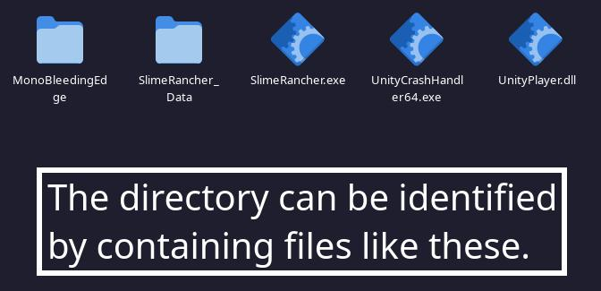

<!--

Hi! So I decided to rewrite the manual a little bit, this time in MarkDown format.
I knew from the start that putting the manual on github in md format was the better option, but I didn't.
Anyway, feel free to contribute to this manual I guess. I hope that this isn't too hard to work on!

- Zervó

-->

# SRMP Manual

This is a detailed manual for the Slime Rancher MultiPlayer mod (SRMP), it has installation instructions, compatibility information, usage instructions, troubleshooting steps and more. It is updated frequently to make it more readable and accurate. Now that it is on github, feel free to contribute! If this manual doesn't answer your questions or in case you don't understand something, feel free to ask in [Saty's Discord](https://discord.gg/NtB7baV).

## Content

Here is a list of content in this document.
Click a link to jump to that section of the document.

[What is SRMP?](#what-is-srmp)

[Compatibility](#compatibility)

[Download the mod](#download-the-mod)

> [Which version to use?](#which-version-to-use)

> [Download on Itch.io](#download-on-itchio-paid)

> [Download on Discord](#download-on-discord-free)

> [Download on GitHub](#download-on-github-free)

[Install the mod](#install-the-mod)

> [Windows](#windows)

> [Linux](#linux)

> [Mac](#mac)

[Using the mod](#using-the-mod)

> [Hosting and Joining](#hosting-and-joining)

> > [Server Codes](#playing-using-server-codes)

> > [Over LAN](#playing-over-lan)

> > [Over VPN](#playing-over-fake-lan-vpn)

> > [Port Forwarding](#playing-over-the-internet-port-forwarding)

> [Console commands](#console-commands)

[Troubleshooting](#troubleshooting)

[Credits](#credits)

## What is SRMP?

Slime Rancher MultiPlayer, or SRMP, is a mod developed by [Saty](https://github.com/SatyPardus) that adds multiplayer functionality to Slime Rancher. Development was abandoned at one point but was recently picked up again by [Twirlbug](https://github.com/Twirlbug).

## Compatibility

SRMP works on all PC versions of the game except for the Microsoft Store version, so: Steam, Epic Games and GoG. Remember, this mod is for Slime Rancher 1, not 2! As Slime Rancher runs natively on windows, so will the mod. Both Slime Rancher and SRMP works on Windows, Linux and Mac. However getting Slime Rancher to work on the latter two may require additional steps, and there are some potential issues with the mod on those platforms that you may encounter (described in the Troubleshooting section). Below is a table to better visualize the platform compatibility for Slime Rancher + SRMP. Note: Table may currently be inaccurate as I don’t have enough data.

<!-- Only update this table if you have done enough testing to feel confident about your results, try not to provide inaccurate information. -->

|  compatibility  |     Windows     |      Linux      |       Mac       |      Other      |
| :-------------: | :-------------: | :-------------: | :-------------: | :-------------: |
|      Steam      |  🟢 Compatible  |  🟢 Compatible  | 🟡 Kinda works  | 🔴 Incompatible |
|   Epic Games    |  🟢 Compatible  | 🟢 Compatible  | ⚪ Unknown  | 🔴 Incompatible |
|       GoG       |  🟢 Compatible  | 🟡 Kinda works  | ⚪ Unknown  | 🔴 Incompatible |
| Microsoft Store | 🔴 Incompatible | 🔴 Incompatible | 🔴 Incompatible | 🔴 Incompatible |

Unknown just means that I didn't have enough data to say if the platform would work or not.

If you want an explanation to a specific entry in the table, select the operating system and platform below:

<!-- REMEMBER: If you updated the table above, also update the explanation below. -->

Windows

    

        
:window: Windows: Steam

        🟢 Compatible: The game runs natively on Windows and Steam, no issues should be caused by this combination.
    

    

        
Windows: Epic Games

        🟢 Compatible: The game runs natively on Windows and Epic Games, no issues should be caused by this combination.
    

    

        
Windows: GoG

        🟢 Compatible: The game runs natively on Windows and GoG, no issues should be caused by this combination.
    

    

        
Windows: Microsoft Store

        🔴 Incompatible: As with everything else from the Microsoft Store, this version of the game is scuffed.
    

:penguin: Linux

    

        
Linux: Steam

        🟢 Compatible: By using proton and then installing the mod as you would on windows, you get the same performance and probably no issues.
    

    

        
Linux: Epic Games

        🟡 Kinda works: So far only tested through Heroic Games Launcher as well as Lutris. I have had broken UI but that could likely be due to how bad my old setup was. Seems to have slightly worse performance than on Steam but it is likely not an issue with SRMP and that difference was pretty much eliminated for me after enabling virtual desktop.
    

    

        
Linux: GoG

        🟡 Kinda works: I've only done minimal testing but from what the information I gathered there didn't seem to be any issues. Will still put this as Kinda works until I gather more data.
    

    

        
Linux: Microsoft Store

        🔴 Incompatible: Good luck getting Microsoft Store working on linux. Even if you did, this version doesn't work with the mod.
    

:apple: Mac

    

        
Mac: Steam

        ⚪ Unknown: Not tested (by the original manual author) yet. Not enough data to cover this entry.
    

    

        
Mac: Epic Games

        ⚪ Unknown: Not tested (by the original manual author) yet. Not enough data to cover this entry.
    

    

        
Mac: GoG

        ⚪ Unknown: Not tested (by the original manual author) yet. Not enough data to cover this entry.
    

    

        
Mac: Microsoft Store

        🔴 Incompatible: Good luck getting Microsoft Store working on Mac. Even if you did, this version doesn't work with the mod.
    

### Playing with other mods

By using the SRML version of SRMP, it is possible to play with other mods. Keep in mind however, that SRMP has no official support for other mods and if you are experiencing issues with SRMP then removing other mods should be the first thing to try. Also, DO NOT place mods in the "Mods" folder when using the Standalone version of the mod, there will be problems. With that out of the way; below is a list of known compatible mods.

SRMP+SRML mod compatibility list

**_This list may be outdated, it is currently based on information found [here](https://docs.google.com/document/d/1JsofvJNLPK5r3XIF-MHBLWBKDzB8GUmGcia9eVnYvJ4)._** I will update it with new information as I receive it. If you want to help, please follow the testing procedure described in the document I just linked. Feel free to give us any information you have to contribute with on discord, or contribute directly to this document if you feel comfortable doing that.

| Mod Name                                                                     | Compatible | Date Updated | Mod Ver. | SRMP Ver. | Tested By  | Notes                    |
| :--------------------------------------------------------------------------- | :--------- | :----------: | :------: | :-------: | :--------: | :----------------------- |
| [AshAndSteam](https://www.nexusmods.com/slimerancher/mods/101)               | 🔴 No      |   2022-?-?   | Unknown  |  Unknown  | ClaraCrazy | duplicate key            |
| [BubbleSlimes](https://www.nexusmods.com/slimerancher/mods/100)              | 🟢 Yes     |   2022-?-?   | Unknown  |  Unknown  | ClaraCrazy |                          |
| [Elemental Slimes](https://www.nexusmods.com/slimerancher/mods/129)          | 🔴 No      |   2022-?-?   | Unknown  |  Unknown  | ClaraCrazy | duplicate key            |
| [FireSlimeFixes](https://www.nexusmods.com/slimerancher/mods/268)            | 🔴 No      |   2022-?-?   | Unknown  |  Unknown  | ClaraCrazy | duplicate key            |
| [FrostysQuicksliverRancher](https://www.nexusmods.com/slimerancher/mods/130) | 🟢 Yes     |   2022-?-?   | Unknown  |  Unknown  | ClaraCrazy |                          |
| [GemSlimes](https://www.nexusmods.com/slimerancher/mods/104)                 | 🔴 No      |   2022-?-?   | Unknown  |  Unknown  | ClaraCrazy | duplicate key            |
| [ItemShop](https://www.nexusmods.com/slimerancher/mods/285)                  | 🟢 Yes     |   2022-?-?   | Unknown  |  Unknown  | ClaraCrazy |                          |
| [KeepInventory](https://www.nexusmods.com/slimerancher/mods/305)             | 🟢 Yes     |   2022-?-?   | Unknown  |  Unknown  | ClaraCrazy |                          |
| [Largo Fix](https://www.nexusmods.com/slimerancher/mods/132)                 | 🟢 Yes     |   2022-?-?   | Unknown  |  Unknown  | ClaraCrazy |                          |
| [Largo Library](https://www.nexusmods.com/slimerancher/mods/105)             | 🟢 Yes     |   2022-?-?   | Unknown  |  Unknown  | ClaraCrazy |                          |
| [LuckyPlorts](https://www.nexusmods.com/slimerancher/mods/65)                | 🟢 Yes     |   2022-?-?   | Unknown  |  Unknown  | ClaraCrazy |                          |
| [MainMenuIsland](https://www.nexusmods.com/slimerancher/mods/184)            | 🟢 Yes     |   2022-?-?   | Unknown  |  Unknown  | ClaraCrazy |                          |
| [MarketExpansion](https://www.nexusmods.com/slimerancher/mods/87)            | 🟢 Yes     |   2022-?-?   | Unknown  |  Unknown  | ClaraCrazy |                          |
| [MemorizingFeeder](https://www.nexusmods.com/slimerancher/mods/311)          | 🟢 Yes     |   2022-?-?   | Unknown  |  Unknown  | ClaraCrazy |                          |
| [MoreCorralUpgrades](https://www.nexusmods.com/slimerancher/mods/292)        | 🟢 Yes     |   2022-?-?   | Unknown  |  Unknown  | ClaraCrazy | some users report issues |
| [MoreGordos](https://www.nexusmods.com/slimerancher/mods/131)                | 🔴 No      |   2022-?-?   | Unknown  |  Unknown  | ClaraCrazy | duplicate key            |
| [MoreTitles](https://www.nexusmods.com/slimerancher/mods/322)                | 🟢 Yes     |   2022-?-?   | Unknown  |  Unknown  | ClaraCrazy |                          |
| [MoreVaccables](https://www.nexusmods.com/slimerancher/mods/4)               | 🟡 Kinda   |   2022-?-?   | Unknown  |  Unknown  | ClaraCrazy | possible duping          |
| [MoreVaccablesPatch](https://www.nexusmods.com/slimerancher/mods/328)        | 🟡 Kinda   |   2022-?-?   | Unknown  |  Unknown  | ClaraCrazy | possible duping          |
| [MoSecretStyles](https://www.nexusmods.com/slimerancher/mods/288)            | 🟢 Yes     |   2022-?-?   | Unknown  |  Unknown  | ClaraCrazy |                          |
| [PowerVaccing](https://www.nexusmods.com/slimerancher/mods/289)              | 🟡 Kinda   |   2022-?-?   | Unknown  |  Unknown  | ClaraCrazy | possible duping          |
| [SaberBlob](https://www.nexusmods.com/slimerancher/mods/323)                 | 🟢 Yes     |   2022-?-?   | Unknown  |  Unknown  | ClaraCrazy |                          |
| [SecretStyleRemovalSafety](https://www.nexusmods.com/slimerancher/mods/288)  | 🟢 Yes     |   2022-?-?   | Unknown  |  Unknown  | ClaraCrazy |                          |
| [SecretStyleThings](https://www.nexusmods.com/slimerancher/mods/249)         | 🟢 Yes     |   2022-?-?   | Unknown  |  Unknown  | ClaraCrazy |                          |
| [ShinySlimes](https://www.nexusmods.com/slimerancher/mods/34)                | 🟢 Yes     |   2022-?-?   | Unknown  |  Unknown  | ClaraCrazy |                          |
| [SingularitySlimes](https://www.nexusmods.com/slimerancher/mods/21)          | 🔴 No      |   2022-?-?   | Unknown  |  Unknown  | ClaraCrazy | duplicate key            |
| [SlimePondUpgrades](https://www.nexusmods.com/slimerancher/mods/281)         | 🟢 Yes     |   2022-?-?   | Unknown  |  Unknown  | ClaraCrazy |                          |
| [SlimeAndMarket](https://www.nexusmods.com/slimerancher/mods/118)            | 🟢 Yes     |   2022-?-?   | Unknown  |  Unknown  | ClaraCrazy |                          |
| [SmartVacpack](https://www.nexusmods.com/slimerancher/mods/306)              | 🟡 Kinda   |   2022-?-?   | Unknown  |  Unknown  | ClaraCrazy | possible duping          |
| [SplitterSlimes](https://www.nexusmods.com/slimerancher/mods/258)            | 🔴 No      |   2022-?-?   | Unknown  |  Unknown  | ClaraCrazy | duplicate key            |
| [SRMLRegistryFixes](https://www.nexusmods.com/slimerancher/mods/236)         | 🟢 Yes     |   2022-?-?   | Unknown  |  Unknown  | ClaraCrazy |                          |
| [UpgradeTabs](https://www.nexusmods.com/slimerancher/mods/309)               | 🟢 Yes     |   2022-?-?   | Unknown  |  Unknown  | ClaraCrazy |                          |
| [ZoneUI](https://www.nexusmods.com/slimerancher/mods/167)                    | 🟡 Kinda   |   2022-?-?   | Unknown  |  Unknown  | ClaraCrazy | doesn't show mod slimes  |
| [DimensionWarpSlimes](https://www.nexusmods.com/slimerancher/mods/301)       | 🟢 Yes     |   2022-?-?   | Unknown  |  Unknown  | AceGalaxy  |                          |
| [ExtraVacSlots](https://www.nexusmods.com/slimerancher/mods/219)             | 🔴 No      |   2022-?-?   | Unknown  |  Unknown  | ClaraCrazy | doesn't behave at all    |

NOTE: A mod being listed as compatible doesn't mean it will work well.

## Download the mod

The first step is to download the mod. There are multiple ways to do this, and there are multiple versions to choose from so here is a short explanation. The first alternative: purchasing the mod on itch.io, which supports Saty. The second alternative is Discord, and the third alternative is Github. Do not get the mod from other sources. Before downloading, find out which version you need below.

### Which version to use?

There are many versions and two different “types” of the mod. The latest recommended version of the mod will probably always be the latest github release. If you are unsure, the latest recommended version as of me updating this manual is 1510.

There are two “types” for each version, one called SRML and one called Standalone. SRML is for the Slime Rancher Modlauncher, and allows you to use it with other mods (with varied results). Since that version is installed like any other SRML mod, instructions for that aren’t provided here. Usage instructions still apply. Standalone is for running SRMP standalone, that means independent of other modloaders, and it is actually really easy to install! That’s all you need to know for picking a version, if you are unsure, go with _SRMP_1510_Standalone_.

### Download on Itch.io (donate)

If you want to get the mod and support Saty at the same time, then head to the [itch.io page](https://satypardus.itch.io/slime-rancher-multiplayer-mod)! Here you pay and download your desired version. If you are new to this mod and didn’t read the ‘Which version to use?’ section above, I highly recommend you do so instead of downloading a random file and then bothering people in the discord with your questions. Note that new releases probably won't be published to itch. Now [install the mod](#install-the-mod).

### Download on Discord (free)

The mod is available to download for free in [Saty's Discord](https://discord.gg/NtB7baV). All you need to do is join the discord and then download your desired version from the #multiplayer-development channel. So, now that you have downloaded your mod zip archive, move on to the next step, [installation](#install-the-mod)!

### Download on Github (free)

The most obvious place to get the mod is probably from this github repo, head over to the [releases page](https://github.com/SatyPardus/srmp-public/releases) and get the version you have decided on. Then proceed to [install the mod](#install-the-mod).

## Install the mod

Now that you have downloaded the mod it is time to install it. Remember that these instructions are for the Standalone version, SRML version is installed like other SRML mods and therefor instructions are not provided here. Troubleshooting tips may still apply to SRML version. Now follow the steps for your OS and platform.

### Windows

<!-- Decided to put instructions in details tags to reduce the amount of scrolling needed -->

    
TL;DR

    Find the game installation directory, extract the downloaded zip file into that directory replacing files inside. Done.

1. Finding the game installation directory

The first step to installing the mod is to know where to install it to. We need to find the game installation directory (we will refer to it as GID from now on). This is done a little different depending on which platform (aka launcher) you have the game on. If you have it on multiple and one of them is steam, use steam. If you pirated the game, get out of my manual. Read the section for your launcher.
    

    
> 1.a. Steam

    It is really easy to find the GID on Steam, it only takes a few clicks. Open your library and find Slime Rancher in the list. Rightclick it, hover over ‘Manage’ and click ‘Browse local files’. This should open the explorer (or your default file explorer) in the GID. You know it is the correct directory if it contains a folder called SlimeRancher_Data.
    

    

    
1.b. Epic Games

    Finding the GID on Epic Games can be a little more complicated, as they aren’t installed to a universal location. The easiest thing is to initialize an install for another game and check what the pre-selected installation directory is, cancel the install and then check that directory for your GID. You know it is the correct directory if it contains a folder called SlimeRancher_Data. Another way to find it is to check the path of the Slime Rancher desktop entry/shortcut, or to just reinstall the game to a known location.
    

    

    
1.c. GoG

    Since I (the original manual author) have never used GoG, this is written using information I could find online. According to the GoG support center, games are installed to a universal directory by default, called ‘GoG Games’. This is located in a directory defined by the HOME environment variable. You should be able to find this path by opening command prompt and running the command ‘echo %HOME%’. You know it is the correct directory if it contains a folder called SlimeRancher_Data.
    

2. Installing the mod

Once you know the GID (game installation directory) of your game you can move on to actually installing the mod. First up, make sure you have your GID open in a file explorer. Again the GID can be identified by having a subdirectory called SlimeRancher_Data. Next, open the directory containing the downloaded mod zip archive (probably Downloads). Copy or move the zip into the GID, not into SlimeRancher_Data or another folder inside of the GID, but the GID itself. Now that the zip archive is in place, extract it by right-clicking and selecting ‘extract here’. It should ask to replace a file in SlimeRancher_Data, if it does then select yes, if it doesn’t then you have extracted it to the wrong directory or you just need to move it out of a folder first. Once extracted correctly, it should have replaced a file in SlimeRancher_Data and created a new folder called Mods (do not put other mods in here). That’s it! Now move on to step 3.

3. Verifying the install

Now to test if everything has installed correctly. Start the game from your launcher and wait for it to load. If installed correctly a console window will also open that probably takes focus from the game. Do not panic, this is a feature and the game is still running in another window. Once in the main menu, you should see a gray box in the top-right. If you do, you did everything correctly. If you don’t, try pressing f4 and if it still doesn’t show up then you did something wrong, go back. Now that you have the mod installed correctly, you can enter a username in the gray box, it can be anything and will be the name shown in-game. Now that the mod is installed and working you can move on to using the mod.

### Linux

<!-- Unless someone else does it, I will update this section to be a lot more detailed and easier to understand in the future. -->

TL;DR

Find the game installation directory, extract the downloaded zip file into that directory replacing files inside. Done.

1. Getting the game to run

In case you haven't already, it is strongly recommended to get the game running properly without issues before moving on to modding. I won't go into detail on how to do that here, but if you have it on steam        then use proton. If you have it on Epic Games or GoG then use Lutris, Heroic Games Launcher or a similar solution. Tweak until it runs properly.

2. Finding the game installation directory

This will be quite different depending on where you have the game.

For steam: find slime rancher in your library, right click 'Manage' > 'Browse local files'.
For other launchers, the paths may vary drastically. Most of them have an option to browse files though.

You know it's the correct directory if it contains another directory called "SlimeRancher_Data".

3. Installing the mod

Once you know the GID (game installation directory) of your game you can move on to actually installing the mod. First up, make sure you have your GID open in a file explorer. Again the GID can be identified by having a subdirectory called SlimeRancher_Data. Next, open the directory containing the downloaded mod zip archive (probably Downloads). Copy or move the zip into the GID, not into SlimeRancher_Data or another folder inside of the GID, but the GID itself. Now that the zip archive is in place, extract it into this directory. It should ask to replace a file in SlimeRancher_Data, if it does then select yes, if it doesn’t then you have extracted it to the wrong directory or you just need to move it out of a folder first. Once extracted correctly, it should have replaced a file in SlimeRancher_Data and created a new folder called Mods (do not put other mods in here). That’s it! Now move on to step 4.

4. Verifying the install

Now to test if everything has installed correctly. Start the game from your launcher and wait for it to load. If installed correctly a console window will also open that probably takes focus from the game. Do not panic, this is a feature and the game is still running in another window. Once in the main menu, you should see a gray box in the top-right. If you do, you did everything correctly. If you don’t, try pressing f4 and if it still doesn’t show up then you did something wrong, go back. Now that you have the mod installed correctly, you can enter a username in the gray box, it can be anything and will be the name shown in-game. Now that the mod is installed and working you can move on to using the mod.

### Mac

As I (zervó) have never touched a Mac in my life, I have no idea how this works. Please update on this section.

## Using the mod

<!-- This section requires some work, which I am willing to give but feel free to update this to make it more accurate, more inclusive and easier to understand. -->

### Hosting and joining

Since this mod is all about multiplayer, here are some instructions for playing togheter. There are 4 main methods to choose from: Server Codes, Playing over LAN, Playing over “fake” LAN (VPN), and Playing over the Internet (port forwarding). The options are ranked below from easiest to hardest.

All four methods except server codes have a few things in common. First, make sure to choose a username if you haven’t already, this can be anything and will be the name shown in-game. Second, all three methods use some combination of IP address and port to host and join. An Ipv4 address which is the type you will most likely be using, looks like this: xxx.xxx.xxx.xxx, with x being numbers. Common ones for private IPs (local networks) are 192.168.x.xxx and 10.10.x.xxx. EG 192.168.1.43, 192.168.68.26 or 10.10.1.107. Public IPs (external/WAN connections) usually have completely different numbers but the structure is the same. The port is a combination of 5 numbers, which the host can find once they are in a loaded save.

Note down the port before attempting any of the methods, or use a method with a port that you choose and change the port in the game later.

#### Playing using Server Codes

Server Codes is the easiest and quickest thing to try. To put it simply: it works like port forwarding but isn't port forwarding, and doesn't require any of the work.
All the host has to do is to load a save, host and give the server code to players.

The players then use that code to join.

Done! Note that the success of server codes heavily depends on the host's router and other factors. If you run in to many connection-related issues, let someone else host or try using another method.

#### Playing over LAN

This method only works if you and the other player/s are on the same local network (or same wifi, in incorrect terminology aka Layer 8 lingo). One player takes the role as the host. The host needs to load a save, it can be an old one or a new one it doesn’t matter. Now in the game, the host pauses and checks the menu top right. Now the host notes down the port and clicks ‘Host’.

Now for the players to join. There is a simple way to do that using the local discovery feature of srmp.

If the game is found automatically, you're done! If not, the host needs to find their local IP address. The fastest way to do this is probably through a terminal. On windows: open command prompt, enter ‘ipconfig’ (no ‘ signs) and press enter. Find the correct network adapter in the list and then the local ip. On linux, open a terminal and enter ‘ifconfig’, then do kinda the same thing as on windows. If you don't have net-tools use ´ip a´. Players now from the main menu choose to join a game and join by IP address, entering it into the correct field, and then the port into the correct field and then joining. It’s that simple.

#### Playing over "fake" LAN (VPN)

<!-- I will update this with images as well soon -->

If you aren’t on the same network then there is still a pretty simple way to do it. Introducing, Hamachi! Before you get too exited you should know there is a drawback with this method, two actually. The first one is that you have to sign up for an account, the second one is that Hamachi has a rate limit, meaning that you could run into issues like not being able to see other players and falling through the map. Now the first step to using Hamachi is to getting an account (NOTE: these hamachi instructions are for Windows/Mac, if you are using linux you know better than to use hamachi but you still can, however it is through commandline so you won’t get any help here). You can create an account by going here. Once your account is created and verified and whatnot, download hamachi from their homepage. Now you need to setup and join a hamachi network, which is described pretty well here, skipping the ‘Host a Server’ section and the other game specific part at the end. Once all players are connected to the hamachi network, you just host and join as if you were on the same local network as described in the ‘Playing over LAN’ section above. If Hamachi fails you can try an alternative called Radmin. Hamachi local Ips may be different, if they are then google how to find them or something. I will update this to include instructions for that at some point.

#### Playing over the Internet (port forwarding)

The third and most advanced option is port forwarding, but it is also the one giving the best results if all players aren’t on the same network. There are two ways to port forward: via your router’s admin interface or through a UPnP portmapping client. The second one is easiest and most convenient, but not all routers support it, it could also pose a potential security risk. I would recommend trying UPnP first as it is pretty easy with the client I will be using, and try to do it via the admin interface if UPnP doesn’t work. Using a UPnP client doesn't make the security problems with UPnP bigger, because if it works then it is already enabled in your router which means the security flaws are already present.

Option 1: Via the router's admin interface

    
This method of port forwarding is the most complicated of the two, to be honest the UPnP client I used in those instructions isn’t even complicated at all so try that one first if you haven’t already. Now, to get started with this method you need login credentials for your router. They are usually found on a sticker on the back of the router. There might be one for wifi credentials and one for admin credentials so doublecheck that you have the right one. If you are lucky there is a default address listed on the sticker as well (usually called “internal address” or just “ipv4 address”) that will save you some time by skipping the next part of the instruction, finding your router’s local ip.

On Windows..

Open command prompt and run ‘ipconfig’. Look for something that says ‘default gateway’, that should be your router ip.

On Linux..

Open a terminal and run ‘ip route’. The first thing that is displayed should be something like “default via 192.168.1.1”, that ip address at the end is the one you are looking for.

On Mac..

Open System Preferences, navigate to Network > Advanced > TCP/IP, and find the IP address listed next to “Router”, that is the one you are looking for.

‎

Now that you have the IP of your router, open a web browser and put it into the address field (do not search for it, enter it as an address). It should open a webpage, if it doesn’t and just searches instead, put http:// in front of the address. Now log in with the credentials you found earlier, some routers display a default status page and requires you to press something before showing the login prompt.

Once you are logged in try to find the port forwarding section, for me it was under “NAT/QoS”. It will look a little different on every router. Add a new rule.

Below are the values you should input, each field might be called something different in your router and there might be more fields, or less. Generally the other fields can be left empty, otherwise just google them.

_Application name_: can be whatever, I will use ‘srmp’

_Source net_: can be left empty

_Protocol_: UDP

_External start port_: the port you noted down earlier

_External end port_: same as above

_Internal port_: same as above

_IP Address_: the IP of your machine (instructions on how to find in ‘Playing over LAN’)

_Enable_: yes

Now that the rule is complete, save and/or apply it. You should now be able to exit the admin interface of your router and test the rule. Host the save in the game if you haven’t already.

Your friends join with your public IP and the port as described in the intro to this section.

If you are unsure you can find your public IP at [https://whatismyipaddress.com](https://whatismyipaddress.com) or similar websites. No they don’t “doxx” you, your public IP address is just as the name suggests publicly accessible and is necessary to access the internet. If you are using a VPN, turn it of as it "changes" your public IP to something where you can't map ports.

Didn't work? Make sure the port is open using a website such as [portchecker](https://portchecker.co/)

Option 2: Via an UPnP client

If you are lucky and your router supports UpnP and it is enabled this method will work for you. Using a special program you can utilize UPnP to create port forwards without having access to your router’s admin interface. To do this we will use a program called portmapper, download the .jar file from Assets [here](https://github.com/kaklakariada/portmapper/releases). You need to have java installed on your system. Once you have downloaded the jar file, run it and a window with a bunch of stuff will show up.

**1. Connect to your router.**
If you have a VPN active, deactivate it before continuing. It can cause issues with portmapping and multiplayer in general.
First you need to connect portmapper to your router, this will also tell you if your router has UPnP enabled or not.
Click the '_Connect_' button in the '_Router_' box. Give it a while.
If it works, you will see '_External address_' and '_Internal address_' change from '_(not connected)_' to an IP.

NOTE: If the external address shows up as 100.xx.xx.xx, it is a bogon address and portmappings won't work. In that case you need to change config either in portmapper, your computer or your router. There are a lot of things that could be causing that to happen.

If it doesn't work, click '_PortMapper Settings..._' and change '_UPnP library_' to something else. NOTE: Don't set it to the dummy one.

If none of them worked, then UPnP isn't enabled in your router. The dummy option will always look like it works, but it's for testing and doesn't actually work.

**2. Create port mapping.**
Click '_Create_' in the '_Port mapping presets_' box. A new window will open.

'_Description_' can be whatever you want. I put srmp. NOTE: Illegal characters may cause issues on some routers.

'_Remote host_' can be left empty, but you can also put your friend's public IP for improved security.

For '_Internal Client_' check the '_Use local host_' button. It should select your local network IP, if not make sure you have vpn and tunnels disabled.

Now in the '_Ports_' box click the '_Add_' button.

Sete Protocol to UDP. Set both Internal and External port to the one you noted down earlier. If you didn't note down a port, set it to something like 16530 and change in the game later.

Now click '_Save_'. Then click '_Use_' in the '_Port mapping presets_' box.

**3. Hosting.**
Host with the port that you either noted down or just chose.

Your public IP by which other players will join can be found in portmapper (might be wrong), or with websites like [this](https://whatismyipaddress.com/).
You usually don't have to worry about removing these portmappings once you're done, as most routers do it on reboot.
If you want to remove or edit records, use the corresponding buttons in portmapper.

**4. Joining.**
Players join by the port that you either got or chose, and your public IP.

If it doesn't work and you filled the '_Remote host_' field while creating the record: edit the record, clear that field, save it, and click the use button again.
If it doesn't work and that field is already empty, use a [port checker](https://portchecker.co) to determine if the port is open.
If it still doesn't work, make sure the external address in portmapper and the one found [here](https://whatismyipaddress.com/) are the same. If not, ask for assistance.
If you still need more help, ask for help in the discord.

NOTE: If this method didn't work and UPnP isn't enabled in your router, I don't recommend trying to enable it for future use. As this program demostrates, you don't need any form of authentication to map ports with UPnP. This means that rouge devices on your network could open ports which would allow hackers and other people with malicious intents to get full access to your home network. So if UPnP is disabled, leave it like that (unless you have a very sophisticated network architecture and you know what you're doing).

### Console commands

If you've opened the game after installing the mod then you have probably noticed that there is a black console window that opens after the game and steals focus.
This window can be quite handy for debugging, and can also be used to enter commands to manipulate the game. Below is a list of all currently available commands.

| Command                                 |                  Description                  | Version Introduced |
| :-------------------------------------- | :-------------------------------------------: | :----------------: |
| cheat money [amount]                    |  adds/removes given amount from money score   |      Unknown       |
| cheat keys [amount]                     | adds/removes given amount from current amount |      Unknown       |
| cheat allgadgets                        |        unlocks all gadgets in the game        |      Unknown       |
| cheat spawn [id] ([amount])             |        spawns given amount of given id        |      Unknown       |
| tp [(TargetPlayer)] [DestinationPlayer] |        teleports target to dest player        |      Unknown       |
| listplayers                             |     prints current players to the console     |      Unknown       |
| sleep [hours]                           |        fastforward given in-game hours        |      Unknown       |

## Troubleshooting

Here is a bunch of scenarios where some things with the mod might not work for different reasons, and how to solve those issues. Not all issues are listed here, and if this doesn’t help you, ask in the [Discord](https://discord.gg/NtB7baV). The main README file has an up-to-date list of known issues.

**_Before driving yourself insane trying to find a solution to your problem_**, if it's your first time starting an SRMP session, get all players to restart the game entirely. This can fix some common issues. Restarting the game can also fix issues you may encounter later on. If you are playing with other mods, they could also be causing issues.

Players are invisible

If you are using Hamachi, Radmin or a similar solution then this is likely caused by rate limiting. The mod uses a lot of network traffic, especially when loading. One solution you could try is to disable encryption in Hamachi or whatever solution you are using, or if possible changing/removing any limits. If it doesn’t help immediately then wait a bit. If you have waited for a while and nothing has changed then you probably want to use another method in [using the mod](#using-the-mod). If you have tried everything up to port forwarding and it still doesn’t work then there is something on your network limiting your connection or your network/internet connection is just slow. Try to let someone else be the host.

"Someone with that UUID already online"

This error is caused by an occupied UUID. If you are using a pirated version of the game, get out of this manual! If you aren’t and you still get the issue then open your game installation directory, find the userdata.json file in the SRMP folder and delete it. Restart the game.

Not recieving rewards from the exchange/trades

This bug should be fixed in version 1510 and upward thanks to [Twirlbug](https://github.com/Twirlbug).

DLC Mismatch

This is a common connection error caused by players not having the same DLC activated. This can be solved by deactivating all DLCs or all players getting the same DLCs.
If all players have the same dlc or if they are all deactivated, this can also be solved by going in to the "Manage DLC" menu before hosting/joining.

Missing mod "MonoMod.Utils.GetManagedSizeHelper"

Add the following to the userdata.json file found in the SRMP directory:

**"IgnoredMods": ["MonoMod.Utils.GetManagedSizeHelper"]**

Can't connect to a server

If you can’t connect to a server it is because something is blocking traffic. This could be because the selected port is already in use, there are firewall rules on the host/client machine blocking traffic, there are firewall rules on the router doing the same thing, incorrectly forwarded port etc. It could also be because you entered the wrong address or port.

Players aren't synced

This one is caused by connection issues. If you are using hamachi/radmin it is likely due to rate limiting. Disabling encryption may help. All players restarting can also fix it. If you are using server codes: let someone else host or use another method. Also try to do things to improve your network connection. You should let the person with the fastest and most stable internet connection host.

Falling through the map

This issue can be caused by the same things that cause the "Players are invisible" issue. Try the fixes there. According to some user reports, walking around the map before hosting and letting other players join can also fix these issues.

Game crashing instantly on startup

You probably did something wrong with installing the mod, like installing Standalone when you needed SRMP or the other way around. Or trying to install multiple versions on top of eachother. It is best to start with a fresh install of the game before installing the mod, and that includes clearing the installation directory before or after uninstalling it from your launcher (not all files are removed when uninstalling).

## Credits

The manual was originally written by [Zervó](https://github.com/ZervoTheProtogen) (zervowo on discord).
Contact me if you need help with the manual or just the mod in general.

The mod was created by the amazing [Saty](https://github.com/SatyPardus), she has done an outstanding job and deserves some recognition. Thank you Saty!

The mod is currently maintainted by [Twirlbug](https://github.com/Twirlbug), thank you Twirlbug for picking up development on this mod!
